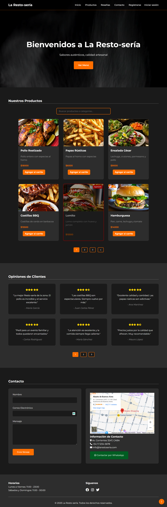
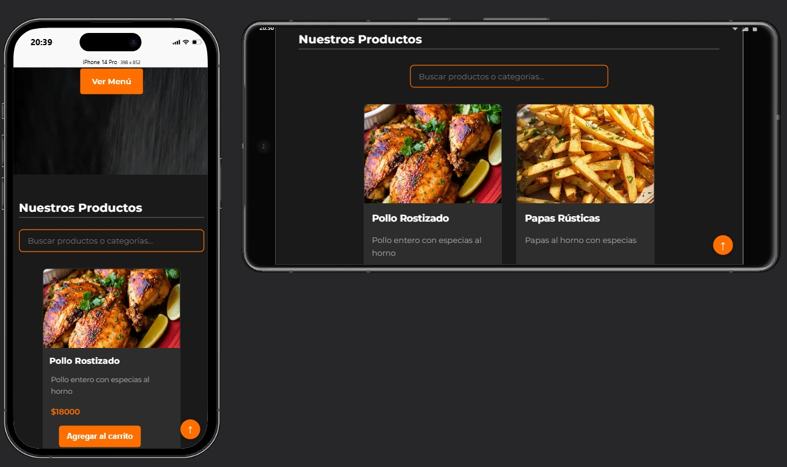
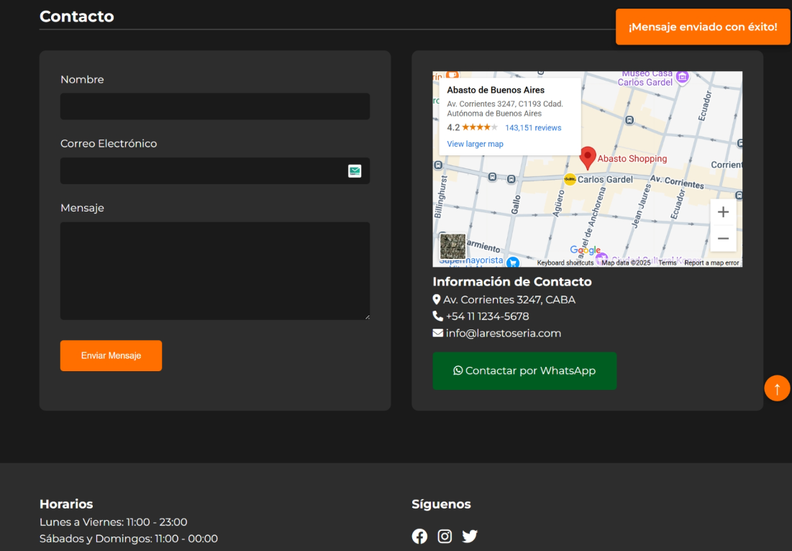
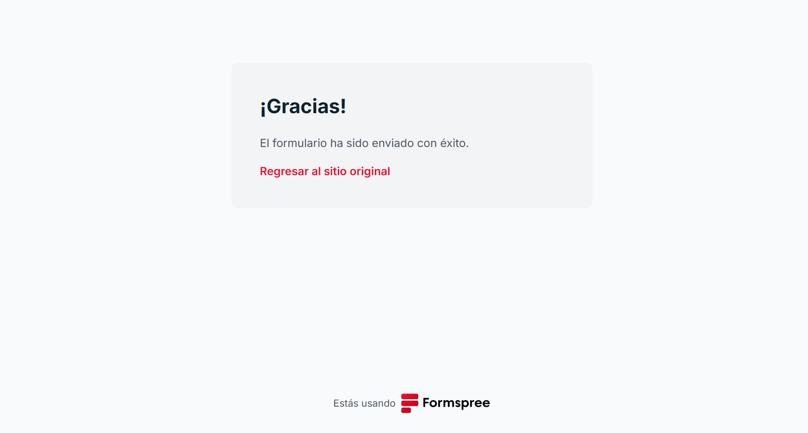

# 🍽️ Restaurante Web - Entrega final v1 ICP

# 🎯 Objetivo del Proyecto Final – E-commerce Interactivo
## 📝 Descripción del Proyecto
Este proyecto es una pre-entrega Frond-End_JS para el curso de Full Stack con Node.js TT. Tiene como objetivo desarrollar una página web completa de comercio electrónico (eCommerce) que integre todos los conocimientos adquiridos durante el curso, incluyendo HTML semántico, CSS moderno, JavaScript, consumo de API REST, almacenamiento local y buenas prácticas de accesibilidad y SEO.

Además de cumplir con todos los requerimientos, se añadieron funcionalidades extra que simulan un entorno más realista, incluyendo una API propia, generación de comprobantes de compra y un panel administrativo (dashboard) que simula un 'backend' (No real) para cargar y gestionar productos.


## 🚀 Características Actuales
- Diseño completamente responsive
- Sección de productos con catálogo de platillos
- Formulario de contacto funcional
- Mapa de ubicación integrado
- Navegación intuitiva

## 🔮 Próximas Implementaciones
- Carrito de compras con JavaScript
- Animaciones interactivas
- Sistema de reservas
- Panel de administración

## 🛠️ Tecnologías Utilizadas
- HTML5
- CSS3
- Formspree (para el formulario de contacto)
- Google Maps Embed API

## 📸 Capturas de Pantalla

### Página Principal
  
<!--URL:  
-->

### Sección de Productos Desktop y Móvil, responsive design 
  
<!--URL:  
-->

### Formulario de Contacto
  

### Confirmación en Formspree
  

<!--URL:  
  
-->


## 🎯 Objetivos del Proyecto
1. Demostrar habilidades en maquetación HTML y CSS
2. Crear una interfaz de usuario intuitiva y atractiva
3. Implementar diseño responsive para todos los dispositivos
4. Sentar las bases para futuras funcionalidades con JavaScript

## 💻 Instalación y Uso
1. Clona este repositorio
```bash
git clone https://github.com/D3M4rc0/proyecto-final-Ecommerce-MarcoCor.git # proyecto-final-Ecommerce-MarcoCor
```
